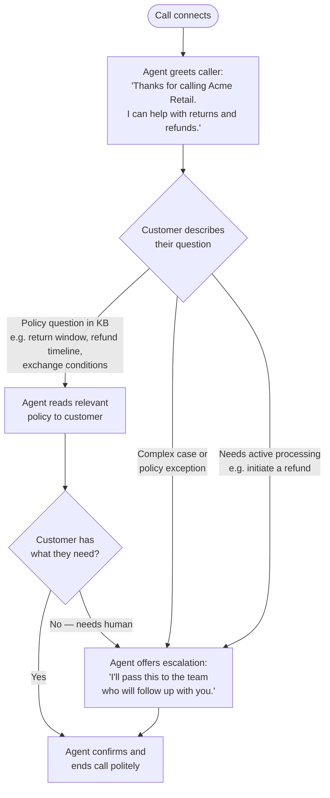

{/* AI-assisted draft | Guidelines version: v2.2 | Source materials: Voice Agent PRD (Product Sheet, internal), Voice Agent Configuration Setup.vtt (Jan Schuette, Voice PM, 2026-04-10) | Date: 2026-04-13 */}

<Note>
  **TL;DR** — Build a working voice agent in 8 steps: connector → knowledge base → retrieval tool → create agent → write prompt → configure agent (voice, SIP, model) → test → monitor. Voice prompting is fundamentally different from chat — define the call flow before writing a single line of prompt.
</Note>

Your retail customer service team receives a high volume of calls outside business hours — customers asking whether they can return a purchase, how long a refund takes, or what the conditions are for an exchange. You want to deploy a voice agent that picks up inbound calls 24/7, answers the most common returns and refunds questions from your policy knowledge base, and closes the call with a clear escalation message when the case is too complex to resolve from policy alone — for example, a damaged item, a policy exception, or a refund that needs to be processed manually.

This guide walks through the full configuration — from mapping the call flow to publishing a live, tested voice agent. For per-field configuration detail on agent settings, see **How to Configure an Agent**.

<Warning>
  **Voice is different from chat.** Chat agents can handle long, branching conversations with multiple topics. Voice agents work best when the call flow is short, linear, and clearly defined before you write the prompt. Start by mapping the flow — then write the prompt from it.
</Warning>

---

## Prerequisites

- Business Analyst or Super Admin role in your octonomy tenant
- A **SIP trunk provider** configured by your implementation team — octonomy does not supply phone numbers; a SIP trunk with valid credentials must be provided by your organisation

{/* GAP: Jan Schuette to confirm — demo number pool for AEs/SDRs, how a sales rep assigns a number during demo setup, and whether this is covered by the Demo Wizard or requires a separate provisioning process. Blocks the voice agent setup path for non-technical users. */}

- Your implementation team has provisioned your octonomy tenant with voice capabilities enabled
- Optionally: a knowledge base or tool for the information the agent needs to retrieve during a call

---

## Before You Write a Single Field: Map the Call Flow

Voice prompting is fundamentally different from chat prompting — what works for text frequently fails for spoken conversation. Before touching any configuration screen, map the call flow the agent is supposed to follow.

A call flow defines:
- What the agent says when the call connects (the **first call message**)
- What questions the agent asks, and in what order
- What happens when the caller gives an unexpected answer
- What the agent says before ending the call

**Example call flow for the retail returns and refunds agent:**



Sketch your own flow before continuing. The prompt you write in Step 5 will follow this structure directly.

---

## Steps

### Step 1: Configure a Connector *(skip if uploading files directly)*

*Why first: the connector authenticates octonomy to your content source. The knowledge base cannot be created until the connector is active.*

If your returns and refunds policy documents already exist as PDFs or files you can upload directly, skip to Step 2 — no connector is needed for manual uploads.

1. Navigate to **Connectors** in the sidebar
2. Locate the shared connector for your content source (e.g. Confluence, SharePoint)
3. Confirm the connector status shows **Active**

For Confluence, you will need:
- Your **Atlassian API access token** (generated in Atlassian → Account Settings → Security → API tokens)
- The **email address** registered in your Atlassian account
- The **base URL** of your Confluence domain: `https://[your-domain].atlassian.net`

{/* SCREENSHOT NEEDED: Shared connector configuration screen with status showing Active */}

**Related guides**
- How to Choose the Right Connector Type — shared vs. HTTP connector decision
- How to Set Up a Connector — full connector setup guide

---

### Step 2: Create a Knowledge Base

*Why second: the knowledge base processes your returns and refunds policy documentation into searchable content. The retrieval tool cannot be created until the knowledge base shows Completed.*

1. Navigate to **Knowledge Bases** in the sidebar
2. Click **Create Knowledge Base**
3. **Live source path:** select your connector from the dropdown, then choose the Confluence space, SharePoint folder, or S3 bucket containing your returns and refunds policy documentation
4. **Manual upload path:** upload your PDF or document files directly — no connector selection required
5. Configure a **scheduled sync** if your returns and refunds policy documentation updates regularly
6. Wait for the status to show **Completed** before proceeding

{/* SCREENSHOT NEEDED: Knowledge base showing Completed status */}

**Related guides**
- How to Create a Knowledge Base — full field-by-field KB creation guide

---

### Step 3: Review the Retrieval Tool

*Why third: when your knowledge base finishes processing, the platform automatically creates a retrieval tool named `kb_[YourKnowledgeBaseName]` in the Tools sidebar. Review the voice-specific settings before using the tool.*

<Warning>
  **Voice tool constraints:** Voice agents support private and custom tools only — web search is not available. Keep tool responses simple: the agent reads them aloud, so structured outputs (tables, bullet lists, markdown) do not translate to spoken language.
</Warning>

1. Navigate to **Tools** in the sidebar
2. Locate the auto-created tool named `kb_[YourKnowledgeBaseName]`
3. Open the tool and update the description to match the voice context — for example: *"Use this tool when the customer asks about return windows, refund timelines, exchange conditions, or any other returns and refunds policy question."*
4. Review the retrieval settings using the guidance below
5. Click **Save**

{/* SCREENSHOT NEEDED: Auto-created kb_ retrieval tool configuration screen with description and retrieval settings visible */}

**Retrieval settings for this use case:**

| Setting | Recommended value | Why |
|---------|------------------|-----|
| **Top K** | Default (30) | A returns and refunds policy knowledge base is small and tightly scoped — a wider retrieval pool adds no benefit |
| **Re-ranking** | Off | Small, natural-language policy content ranks correctly without a second-pass model. Re-ranking adds latency that is audible to callers — enable only if testing reveals the right node surfaces but is not ranked first |
| **Hybrid search** | Off for direct-upload PDFs; On for Confluence / SharePoint | Policy language has no technical codes or acronyms, so semantic search handles it well. Switch on if the knowledge base is sourced from a live content system where mixed content is common |

**Related guides**
- How to Configure a Retrieval Tool — full configuration reference for all retrieval settings

---

### Step 4: Create the Voice Agent

*Why now: creating the agent gives you the container to attach the prompt and configuration to. At this stage, only name and description are required — all voice-specific settings are configured in Step 6.*

1. Navigate to **Agents** in the sidebar
2. Click **Create Agent** and select **Voice** as the agent type
3. Enter the following:

| Field | What to enter |
|-------|--------------|
| **Agent Name** | Internal name for your records — not heard by callers |
| **Description** | Brief description of what this agent does — for internal reference only |

4. Click **Save**

The agent is created. You will configure the voice provider, call messages, AI model, and SIP settings in Step 6 — after writing the prompt.

{/* SCREENSHOT NEEDED: Voice agent creation screen showing Name and Description fields */}

---

### Step 5: Write the Task Prompt

*Why before configuration: the prompt defines the call flow the agent follows. Writing it first means you can reference the exact tool name and escalation language when you configure the first call message in Step 6.*

<Warning>
  **Voice prompting is not chat prompting.** Do not adapt a chat prompt for voice. Voice prompts must be written in natural spoken language, use short sentences, avoid markdown (it is read aloud literally), and follow a defined linear flow.
</Warning>

Use the call flow you mapped before starting this guide as the structure for the prompt. A well-structured voice task prompt has six sections:

**1. Personality — who the agent is and what it does:**

```
# Personality

You are Acme Retail's returns and refunds assistant, handling inbound calls
outside business hours. You are calm, clear, and efficient — you give
customers the answer they need and close the call without unnecessary back-and-forth.

Your role is to help customers understand the returns and refunds policy,
including return windows, refund timelines, and exchange conditions.
You do not speculate, answer from general knowledge, or make up information.
```

**2. Goal — audience, topic, and tool declaration:**

```
# Goal

Help customers resolve returns and refunds questions by searching the
policy knowledge base and delivering clear, spoken answers.

You have access to the following tools:
- Returns and Refunds Policy (retrieval): searches the returns and refunds
  knowledge base for policy content.
  - When to use: whenever the customer asks about return windows, refund
    timelines, exchange conditions, or any related policy question
  - Parameters: use the customer's own words as the search query — no reformatting needed
  - If it fails: Say "I'm having trouble accessing the policy right now.
    Let me connect you with someone from our customer service team."
```

**3. Tone — voice style and prose rule:**

```
# Tone

- Warm and direct — speak as a knowledgeable colleague, not a customer service script
- Keep responses short — the customer cannot scroll back or re-read
- Never use filler phrases like "Great question!" or "Absolutely!"
- Never use bullet points, headers, bold text, or numbered lists in your responses.
  Speak in natural prose only.
```

**4. Task — the call flow and speech normalisation rules:**

```
# Task

When a customer asks a question:

1. Search the Returns and Refunds Policy tool immediately.
   Call {{/toolName@connector-slug}} to do this.
2. Deliver the relevant policy in one to three spoken sentences.
   Do not read document names, section headings, or any formatting.
3. Ask if the customer has the information they need.
4a. If yes — thank the customer and close the call.
4b. If no — follow the Guardrails escalation instructions below.

Speech normalisation — this step is important:
- Say dates as spoken words — for example, say "thirty days from purchase" not "30 days"
- Say currency as words — say "fifty dollars" not "$50"
- Say percentages as words — say "ten percent" not "10%"
```

**5. Guardrails — out-of-scope, escalation, and grounding rules:**

```
# Guardrails

Out of scope: If the customer asks something the policy knowledge base
does not cover, say:
"I don't have information on that. I can connect you with our customer
service team who should be able to help."

Ambiguous questions: Ask exactly one clarifying question before searching.
Never ask two questions in the same turn.

Complex cases: If the customer describes a damaged item, a policy
exception, or needs a refund processed, say:
"I'll pass this to our customer service team, who will follow up
with you within one business day. Is there anything else I can help with?"

This step is important: Never generate an answer that is not grounded
in a tool result. If the tool returns no content, say so in natural
spoken language.
```

**6. Error handling — tool failure, unclear speech, frustrated callers:**

```
# Error Handling

- If the tool fails or times out: Say "I'm having trouble accessing the
  policy right now. Let me connect you with someone who can help."
  Never go silent.
- If the customer's speech is unclear: Say "I didn't quite catch that —
  could you say it again?" Ask only once before offering to escalate.
- If the customer is frustrated: Acknowledge first, then act. Say
  "I understand that's frustrating. Let me look into that for you right now."
```

<Warning>
  **Tool reference syntax:** Use the `/` command in the prompt editor to insert tool references. Type `/`, select your tool from the menu, and octonomy inserts the reference automatically. Do not type or edit the reference manually — any change breaks execution.
</Warning>

{/* SCREENSHOT NEEDED: Voice agent task prompt editor showing a complete call flow prompt with tool reference */}

**Related guides**
- How to Prompt Agent Tasks — full prompt writing guide including the voice template

---

### Step 6: Configure the Agent

*Why after the prompt: the first call message references the call flow you just defined. Configuring these fields after writing the prompt ensures they are consistent.*

The voice agent configuration is split across four tabs. Work through them in order.

#### General Tab

| Field | What to enter |
|-------|--------------|
| **Agent Name** | Internal name — not heard by callers |
| **Agent Description** | Brief description for internal reference |

#### Agent Settings Tab

**Voice settings**

| Field | What to enter |
|-------|--------------|
| **Voice Assistant Provider** | Fixed as **ElevenLabs** — cannot be changed |
| **Language** | Select the caller's language. This setting controls both STT (speech-to-text, what the agent hears) and TTS (text-to-speech, what the agent says). Set this to match your callers' primary language. |
| **Voice Provider** | Select the ElevenLabs TTS model. Three options are available — see guidance below. |
| **First Call Message** | The exact greeting spoken when the call connects. Must match the opening of your call flow. Example: *"Thanks for calling Acme Retail. I can help with returns and refunds — what's your question?"* |
| **Disable Interruptions** | Off by default. Enable only when the agent must complete a full statement without interruption — for example, legal disclaimers or safety instructions. |
| **Skip Turn** | Off by default. When enabled, the agent waits instead of responding when the caller signals they need a moment ("give me a second"). Enable for use cases where callers may need to look something up mid-call. |
| **Max Conversation Duration** | Maximum call length in seconds. Set a limit appropriate for your use case — longer calls incur higher costs. |
| **Phone Number** | Read-only. Displays the inbound phone number routed to this agent. Phone numbers are provisioned by your octonomy administrator. |
| **Pronunciation Custom Dictionary** | Upload a file defining how specific terms should be pronounced. Use for product names, acronyms, or technical terms the TTS engine mispronounces. |

**Voice Provider options**

| Option | Best for | Trade-off |
|--------|----------|-----------|
| **Eleven Multilingual** | Use cases where voice expressiveness and natural prosody matter most | Higher latency than Flash and Turbo |
| **Eleven Turbo** | Most voice agent deployments — good balance of quality and speed | Slightly higher latency than Flash, noticeably better voice quality |
| **Eleven Flash** | Highest-throughput, lowest-latency scenarios where speed is critical | Lowest latency, lower voice quality than Turbo |

For the returns and refunds use case, **Eleven Turbo** is recommended — callers expect natural-sounding responses, and the latency difference is not perceptible in normal conversation.

{/* SCREENSHOT NEEDED: Agent Settings tab showing Voice Provider dropdown and toggle fields — Disable Interruptions, Skip Turn, Max Conversation Duration */}

#### AI Settings Tab

| Field | What to enter |
|-------|--------------|
| **LLM Provider** | Leave at the default unless your implementation team advises otherwise |
| **Model** | Leave at the default. The platform selects an appropriate model for voice workloads. |
| **Agent Temperature** | Leave at the default (0.2). Lower values produce more consistent, predictable responses — important for voice where improvisation can sound unnatural. |
| **Max Token Usage for Response** | Leave at the default unless your implementation team specifies a limit. |

{/* SCREENSHOT NEEDED: AI Settings tab showing LLM Provider, Model, Temperature, Max Token Usage fields */}

#### Insights Tab

| Field | What to enter |
|-------|--------------|
| **Insights** | Toggle on. When enabled, conversation data accumulates in the Insights dashboard — resolution rate, automation rate, and top topics. Leave on for all production agents. |

**Related guides**
- How to Configure an Agent — full per-field reference for all agent settings

---

### Step 7: Test the Agent

*Test the call flow before going live to confirm voice quality, call flow logic, and retrieval accuracy.*

#### Test a Live Call

Place a test call to the number routed to this agent. Work through the call flow you defined:

1. Confirm the **first call message** plays correctly and sounds natural
2. Ask a policy question — for example, the return window or refund timeline — and confirm the agent retrieves and reads the relevant policy in plain spoken language
3. Describe a complex case — for example, a damaged item or a request to process a refund — and confirm the agent escalates correctly without attempting to process the request
4. Confirm the closing message sounds natural and the call ends cleanly

Listen for:
- **Unnatural phrasing** — if a sentence sounds awkward aloud, rewrite it in the prompt
- **Markdown artefacts** — if the agent says "asterisk" or reads a URL literally, remove that formatting from the prompt or tool response
- **Flow breaks** — if the agent jumps steps or loses the thread, review the call flow section of the prompt for clarity

#### Check the Retrieval Layer Independently

1. Navigate to **Knowledge Bases**, open your knowledge base, and use the **Node Browser** search
2. Run the same questions you tested on the call
3. Confirm the correct nodes surface — if the wrong nodes appear here, the problem is in the knowledge base or retrieval tool configuration, not the prompt

{/* SCREENSHOT NEEDED: Test call interface or SIP test tool showing a successful call flow */}

---

### Step 8: Monitor and Refine

*Performance data only accumulates once the agent is handling live calls.*

Use **Insights** and **Conversations** together as a continuous improvement cycle:

**Insights** shows resolution rate, automation rate, and top topics across all calls. Use it for weekly performance reviews.

**Conversations** shows full call transcripts with agent reasoning steps and tool call records. Use it to read exactly what happened in a failed or escalated call and confirm root causes before making prompt changes.

The improvement cycle runs: **Insights** (which metric is off?) → **Conversations** (what happened in those calls?) → **Action** (refine the call flow in the prompt, add missing content to the knowledge base, or fix a tool configuration).

**Related guides**
- How to Use the Insights Dashboard — full guide to all four dashboard views
- How to Review Conversations — reading transcripts and identifying improvement opportunities

---

## Result

You have a live out-of-hours returns and refunds agent that:
- Answers inbound calls 24/7 via a SIP trunk connection
- Follows a defined call flow — greet, retrieve from the returns and refunds knowledge base, respond, escalate or close
- Reads policy answers (return windows, refund timelines, exchange conditions) in natural spoken language
- Handles complex cases (damaged items, policy exceptions, requests to process a refund) with a consistent escalation message and no guessing
- Generates data in Insights for ongoing performance monitoring and prompt refinement

---

## Next Steps

- **How to Prompt Agent Tasks** — voice prompt template and best practices for spoken conversation
- **How to Configure an Agent** — per-field reference for all agent settings
- **How to Configure a Retrieval Tool** — retrieval configuration including Top K, re-ranking, and metadata filtering
- **How to Choose the Right Agent Architecture** — when to use a single voice agent vs. a more complex setup
